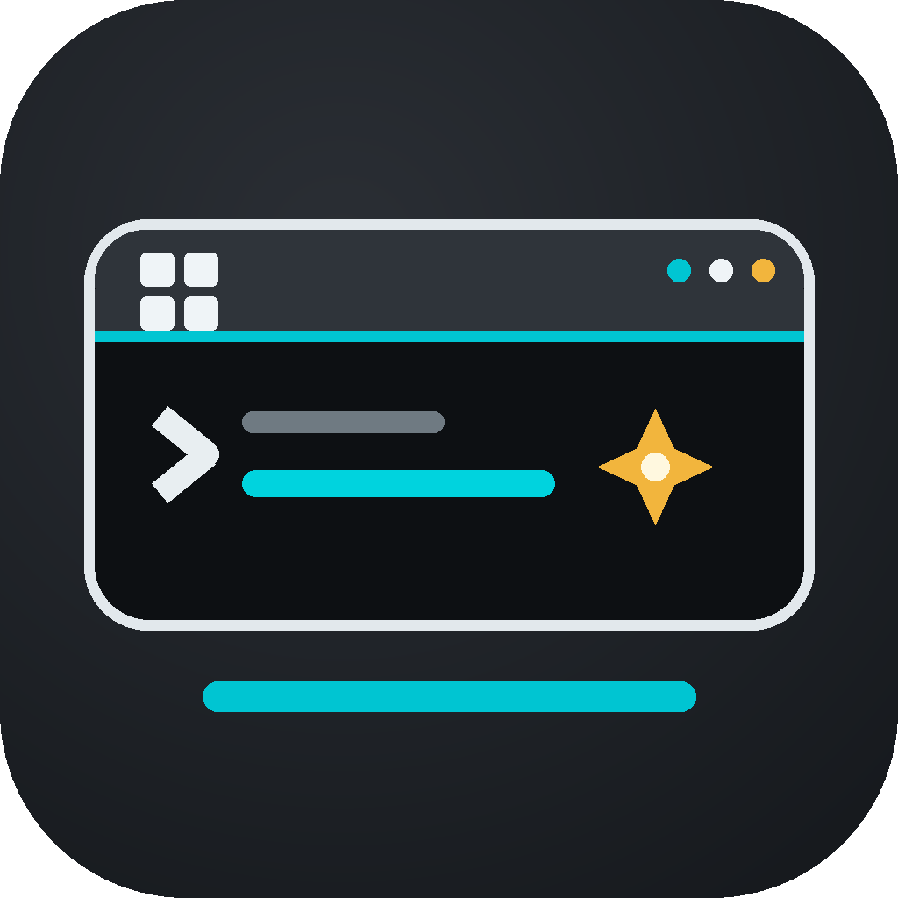

<p align="center">
  
</p>

# Project凌

ProjectLing 是面向 Windows 与 Android Termux 的终端协作程序。两个平台共用同一套核心代码、设置、角色、上下文和工具接口。

## 适用范围

- Windows 10/11
- Android + Termux / AITermux
- Gemini 与 DeepSeek 兼容接口

## 启动

### Windows

安装 Python 3 后，双击根目录 `PROJECT凌.exe`。

### Termux

```bash
git clone https://github.com/jiangshanyao2200-hue/ProjectLing.git
cd ProjectLing
bash Termux/install.sh
./run.sh
```

## 常用命令

- `/settings`：设置服务商、Key、模型与网络搜索
- `/role`：管理角色、主星和执行星
- `/exit`：保存并退出

## 目录

```text
PROJECT凌.exe   Windows 启动入口
run.sh          Termux / AITermux 启动入口
app/            共用核心程序
Windows/        Windows 工具
Termux/         Termux 安装脚本
docs/           模型与发布文档
```

## 发布边界

公开仓库不包含 API Key、本机配置、聊天历史、上下文、记忆或调试日志。首次启动时会在本机生成这些文件，请勿提交到公开仓库。
